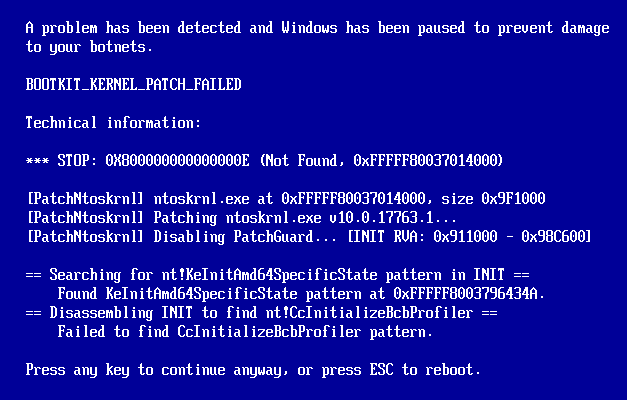
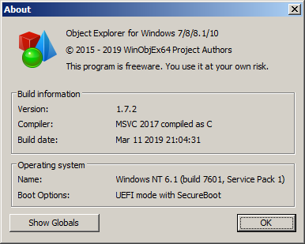
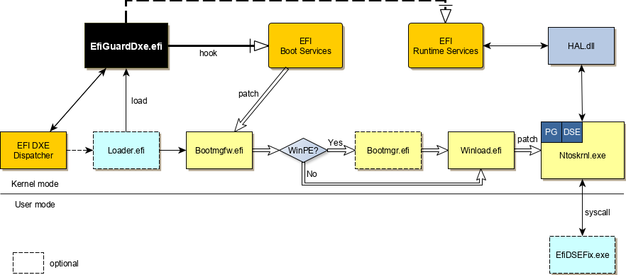

# Overview
EfiGuard is a portable x64 UEFI bootkit that patches the Windows boot manager, boot loader and kernel at boot time in order to disable PatchGuard and Driver Signature Enforcement (DSE).

# Features
- Currently supports all EFI-compatible versions of Windows x64 ever released, from Vista SP1 to Server 2019.
- Easy to use: can be booted from a USB stick via a loader application that automatically finds and boots Windows. The driver can also be loaded and configured manually using either the UEFI shell or the loader.
- Makes extensive use of the [Zydis](https://github.com/zyantific/zydis) disassembler library for fast runtime instruction decoding to support more robust analysis than what is possible with signature matching, which often requires changes with new OS updates.
- Works passively: the driver does not load or start the Windows boot manager. Instead it acts on a load of `bootmgfw.efi` by the firmware boot manager via the boot selection menu or an EFI application such as the loader. If a non-Windows OS is booted, the driver will automatically unload itself.
- Supports four-stage patching for when `bootmgfw.efi` starts `bootmgr.efi` rather than `winload.efi`. This is the case when a WIM file is loaded to boot WinPE, Windows Setup or Windows Recovery mode.
- Graceful recovery: in case of patch failure, the driver will display error information and prompt to continue booting or to reboot by pressing ESC. This is true even up to the final kernel patch stage, because the last patch stage happens before `ExitBootServices` is called. Many UEFI Windows bootkits hook `OslArchTransferToKernel` which, while easy to find by pattern matching, is a function that executes in protected mode after `ExitBootServices`. This means no boot services are available to tell the user that something went wrong.
  

  Simulated patch failure with error information
- Debuggable: can output messages to a kernel debugger and to the screen (albeit buffered) during the kernel patching stage, and to a serial port or unbuffered to the screen during the boot manager and boot loader patching stages. If the driver is compiled with PDB debug information, it is possible to load the debug symbols at any point after HAL initialization by specifying the virtual DXE driver base and debugging it as you would a regular NT driver.
- DSE bypasses: available as either a straightforward [UPGDSED](https://github.com/hfiref0x/UPGDSED)-style DSE disable at boot time or as a hook on the `SetVariable()` EFI runtime service. The latter serves as an arbitrary kernel mode read/write backdoor that can be called from Windows using `NtSetSystemEnvironmentValueEx` and allows setting `g_CiEnabled`/`g_CiOptions` to the desired value. A small DSEFix-style application named `EfiDSEFix.exe` is provided that can be used to do this. It is also possible to leave DSE enabled and to disable only PatchGuard. The loader will use the `SetVariable` hook method by default, due to the fact that some anti-cheat and anti-virus programs do not understand the difference between cheats or malware and self-signed drivers in general and target the UPGDSED fix.
- Supports on-disk modified kernels and boot loaders by patching `ImgpValidateImageHash` at every stage as well as `ImgpFilterValidationFailure`, which may silently rat out some classes of violations to a TPM or the SI log file.
- Allows Secure Boot to work with Windows 7 (not a joke!). Windows 7 itself is oblivious to Secure Boot as it does not support it, or (<a href="https://msdn.microsoft.com/en-us/ie/dn938339(v=vs.60)">officially</a>) even booting without CSM. This is useful for people who want to use Windows 7 on a locked down device that requires WHQL Secure Boot. Wiki entry on how to get this to work [here](https://github.com/Mattiwatti/EfiGuard/wiki/Secure-boot-on-Windows-7).
  

  [WinObjEx64](https://github.com/hfiref0x/WinObjEx64) on Windows 7 with Secure Boot enabled

# Issues and limitations
- EfiGuard can not disable Hypervisor-enforced Code Integrity (HVCI or HyperGuard) due to HVCI running at a greater privilege level. EfiGuard **can** coexist with HVCI and even successfully disables PatchGuard in the normal kernel, but this is not useful in practice because HVCI will catch what PatchGuard did previously. Both types of DSE bypass are rendered useless by HVCI: the boot time patch has no effect because the kernel defers to the secure kernel for integrity checks, and the `SetVariable` hook will cause a `SECURE_KERNEL_ERROR` bugcheck if it is used to write to `g_CiOptions`.
- Checked kernels are not supported due to the differences in PatchGuard and DSE initialization code caused by disabled optimizations and added asserts, as well as additional changes to PatchGuard in checked kernels. This should not be an issue as checked kernels are not generally useful without a kernel debugger attached, which disables PatchGuard.
- The loader application is currently not directly bootable on some PCs (e.g. Dell XPS). In this case the UEFI shell can be used as a fallback (see below).

# How to use
There are two ways to use EfiGuard: booting the loader (easiest), or using the UEFI shell to load the driver.
## Booting the loader
1. Download or compile EfiGuard, go to `EFI/Boot` and rename one of `Loader.efi` or `Loader.config.efi` to `bootx64.efi`. The two are identical, except `Loader.efi` boots without user interaction whereas `Loader.config.efi` will prompt you to configure the DSE patch method used by the driver (if you want to change this).
2. Place the files on a boot drive such as a USB stick (for physical machines) or an ISO/virtual disk (for VMs). The paths should be `/EFI/Boot/{bootx64|EfiGuardDxe}.efi`. It is recommended to use FAT32 formatted USB sticks.
3. Boot the machine from the new drive instead of booting Windows. Most firmwares provide a boot menu to do this (accessible via F10/F11/F12). If not, you will need to configure the BIOS to boot from the new drive.
4. If you are using the default loader, Windows should now boot, and you should see EfiGuard messages during boot. If you are using the configurable loader, answer the configuration prompts and Windows will boot.
5. If you booted with the `SetVariable` hook (the default), run `EfiDSEFix.exe -d` from a command prompt after boot to disable DSE. Run `EfiDSEFix.exe` to see the full list of options.

## Using the UEFI shell to load the driver
1. Follow the steps 1 and 2 as above, but do not rename the loader to `bootx64.efi`. Instead, either use the BIOS-provided shell (if you have one), or download the [EDK2 UEFI Shell](https://github.com/tianocore/edk2/blob/master/ShellBinPkg/UefiShell/X64/Shell.efi?raw=true) and rename it to `bootx64.efi`.
2. Boot the machine to the UEFI shell.
3. `cd` to `/EFI/Boot` on the correct filesystem and run `load EfiGuardDxe.efi` to load the driver.
4. (Optional) Run either `Loader.efi` or `Loader.config.efi` from the same directory to boot Windows. You can also continue working in the shell, or `exit` to go back to the BIOS/boot menu and boot from there.
5. After boot, apply the DSE fix as above if applicable.

# Compilation
## Compiling EfiGuardDxe and the loader
EfiGuard requires EDK2 to build. If you don't have EDK2 installed, follow the steps in [Getting Started with EDK2](https://github.com/tianocore/tianocore.github.io/wiki/Getting-Started-with-EDK-II) first as the EDK2 build system is fairly complex to set up. This section assumes you have a `workspace` directory that your `WORKSPACE` environment variable points to, with a copy of EDK2 checked out in `workspace/edk2`. Supported compilers are MSVC, Clang, GCC and ICL.
1. Clone the EfiGuard repository into `workspace/edk2/EfiGuardPkg`.
2. Open a prompt or shell that sets up the environment variables for EDK2.
3. Run `build -a X64 -t VS2017 -p EfiGuardPkg/EfiGuardPkg.dsc -b RELEASE`, substituting your toolchain for VS2017.

This will produce `EfiGuardDxe.efi` and `Loader.efi` in `workspace/Build/EfiGuard/RELEASE_VS2017/X64`.
To build the interactively configurable loader, append `-D CONFIGURE_DRIVER=1` to the build command.

## Compiling EfiDSEFix
EfiDSEFix requires Visual Studio to build.
1. Open `EfiGuard.sln` and build the solution.

The output binary `EfiDSEFix.exe` will be in `Application/EfiDSEFix/bin`.

The Visual Studio solution also includes projects for `EfiGuardDxe.efi` and `Loader.efi` which can be used with [VisualUefi](https://github.com/ionescu007/VisualUefi), but these projects are not built by default as they will not link without additional code, and the build output will be inferior (bigger) than what EDK2 produces. `Loader.efi` will not link at all due to VisualUefi missing UefiBootManagerLib. These project files are thus meant as a development aid only and the EFI files should still be compiled with EDK2. To set up VisualUefi for this purpose, clone the repository into `workspace/VisualUefi` and open `EfiGuard.sln`.

# Architecture
  
While EfiGuard is a UEFI bootkit, it did not start out as one. EfiGuard was originally an on-disk patcher running on NT (similar to [UPGDSED](https://github.com/hfiref0x/UPGDSED)), intended to test the viability of a disassembler-based aproach, as opposed to using PDB symbols and version-specific signatures. [PatchNtoskrnl.c](EfiGuardDxe/PatchNtoskrnl.c) still looks very much like this original design. Only after this approach proved successful, with no modifications to code needed in over a year of Windows updates, did UEFI come into the picture as a way to further improve capabilities and ease of use.

Some of the benefits provided by a bootkit approach include:
- No on-disk modifications to kernels or bootloaders needed.
- No need to modify the boot configuration store using `bcdedit`.
- No need to patch `ImgpValidateImageHash` (although this is still optionally done).
- Ironically, the use of a bootkit allows enabling Secure Boot, provided you own the Platform Key and are able to add your personal certificate to the `db` store.

The initial incarnation of EfiGuard as a bootkit was an attempt to get dude719's [UEFI-Bootkit](https://github.com/ajkhoury/UEFI-Bootkit) to work with recent versions of Windows 10, because it had become dated and no longer works on the latest versions (like UPGDSED, often caused by version-sensitive pattern scans). While I did eventually get this to work, I was unsatisfied with the result mostly due to the choice of hooking `OslArchTransferToKernel`, which as noted above executes in protected mode and after `ExitBootServices` has been called. Apart from this, I was not satisfied with only being able to patch some versions of Windows 10; I wanted the bootkit to work on every EFI-compatible version of Windows x64 released to date. Because of this, I rewrote the bootkit from scratch with the following aims:
- To provide patch information at every stage of boot including the kernel patch itself.
- To increase the number of supported EFI-compatible Windows versions to "all" (at the time of writing).
- To enable lazy instantiation of the bootkit and optionally a kernel backdoor, achieved by EFI System Table hooks.

A big picture overview of the final EfiGuard boot flow is shown in the diagram above. For the individual component-specific hooks and patches, see `EfiGuardDxe/PatchXxx.c` in the source files. For driver initialization/unloading and the EFI Boot and Runtime Services hooks, see [EfiGuardDxe.c](EfiGuardDxe/EfiGuardDxe.c).

# Credits
- [UPGDSED](https://github.com/hfiref0x/UPGDSED) by [hfiref0x](https://github.com/hfiref0x) and [Fyyre](https://github.com/Fyyre)
- [Zydis](https://github.com/zyantific/zydis) by [zyantific](https://zydis.re)
- [Uninformed](http://uninformed.org/) articles on PatchGuard [v1](http://uninformed.org/index.cgi?v=3&a=3&t=pdf), [v2](http://www.uninformed.org/?v=6&a=1&t=pdf) and [v3](http://uninformed.org/index.cgi?v=8&a=5&t=pdf) by Skywing
- [UEFI-Bootkit](https://github.com/ajkhoury/UEFI-Bootkit) by [dude719](https://github.com/ajkhoury)
- [ReactOS](https://reactos.org)

# License
EfiGuard is licensed under the GPLv3. Files in the `EfiGuardDxe/Zydis` submodule are licensed under the MIT license.
